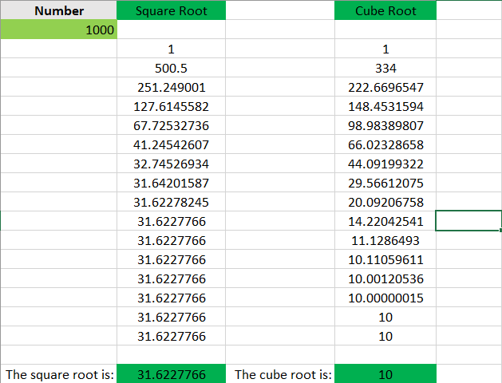

# Assignment 2

### Compute the value of Cos(x/4) by Taylor Series expansion to 10 terms using For loop in Matlab.

* It is asked to approximate the value of $$cos(\pi/4)$$​ using Taylor series.
* $$cos(x) = 1 - \frac{x^2}{2!} + \frac{x^4}{4!} - ... =  \displaystyle\sum_{k=1}^n   \frac{(-1)^k x^{2k}}{(2k)!}$$
* We can use the above formula to compute $$cos(\pi/4)$$​ using for loop

```matlab
cos = 0;
%n = input('Enter iterations required: ');
n = 10;
x = pi/4
for k=0:n
    cos = cos+ (-1)^k * (x^(2*k)/factorial(2*k));
end
cos
```

* This loop runs of n times and finally displays the value of cos.

### Compute the value of Sin(x/4) by Taylor Series expansion to 10 terms using 'while' loop in Matlab.

* We can do this using the formula for taylor series of sin(x).
* $$sin(x) = x - \frac{x^3}{3!} + \frac{x^5}{5!} - ... =  \displaystyle\sum_{k=1}^n   \frac{(-1)^k x^{2k+1}}{(2k+1)!}$$

```matlab
sin = 0;
n = 10;
x = pi/4
k=0;
while k<=n
 sin = sin+ (-1)^k * (x^(2*k+1)/factorial(2*k+1));
 k = k+1;
end
sin
```

### Compute the value of ​$$e^2$$​ by Taylor Series expansion to 10 terms using for loop.

* $$e^2 = \displaystyle\sum_{k=1}^n   \frac{2^k}{k!}$$

```matlab
x = 0;
n =10;
for k=0:n
 x = x + (2^k)/factorial(k);
end
x
```

### Compute the value of $$e^{-2}$$ by Taylor Series expansion to 10 terms using 'while' loop.

* $$e^{-2} = \displaystyle\sum_{k=1}^n   \frac{-2^k}{k!}$$

```matlab
x = 0;
n =10;
k = 0;
while k<=n
 x = x + ((-2)^k)/factorial(k);
 k = k + 1;
end
x
```

### Using Excel to compute the values of previous questions.

* We can use the same formula and by dragging the cell, we can find the required values.
  * Then we can use Conditional Formatting to highlight when the value gets converged.

<figure><figcaption></figcaption></figure>

* For e^2 and e^-2, the values don't converge within 10 iterations. So 20 iterations are done.

<figure><figcaption></figcaption></figure>

### Find the square and cube root of 1000 using iterative formula.

* To find the square root, first we have to take 1000 then for every iteration divide it by the value got from the previous iteration and divide it by 2.
* To find the cube root, we have to take 1000, then for every iteration divide it by the sqaure of the value got from the previous iteration, multiply it by 2 and divide it whole by 3.

<figure><figcaption></figcaption></figure>
